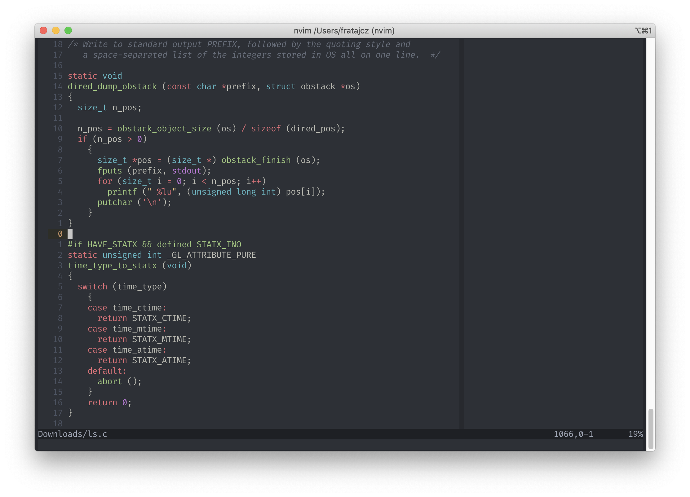

one-monokai-vim
===========

* The colors are from [azemoth/vscode-one-monokai](https://github.com/azemoh/vscode-one-monokai).
* The original vim colorscheme is from [crusoexia/vim-monokai](https://github.com/crusoexia/vim-monokai)

Install
-------

### [vim-plug](https://github.com/junegunn/vim-plug)

    Plug 'fratajczak/one-monokai-vim'

### Manually

```bash
mkdir -p ~/.vim/colors
```
    
Download the `colors/one-monokai.vim` file from the repo to `~/.vim/colors`

Usage
-----

Add the command below to your `~/.vimrc`:

```VimL
syntax on
colorscheme one-monokai
```

Terminal support
----------------

If you are using a terminal which supports truecolor like **iterm2**, enable the gui color by adding the setting below in `~/.vimrc` or `~/.vim/init.vim`

```VimL
set termguicolors
```

Otherwise, use below setting to activate the 256 colors in your terminal

```VimL
set t_Co=256
```

Configuration
-------------

### Italic

By default the gui enables italic but not the terminal. They both can be configured.
    
If you are using a font that supports italic, paste the command below in your `.vimrc` to turn on terminal italic:

    let g:monokai_term_italic = 1
    let g:monokai_gui_italic = 1

Screenshots
-----------


